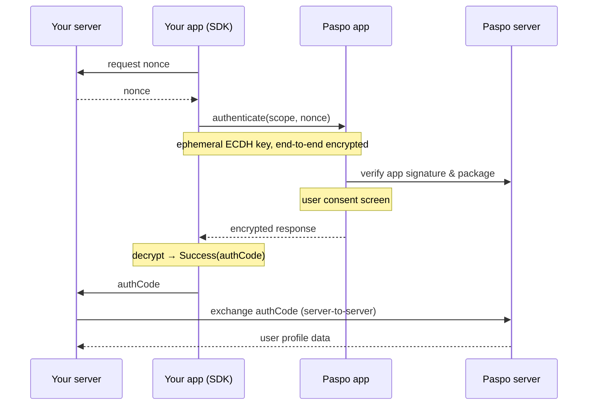

# Paspo ID Android SDK

English | [Русский](README.ru.md)

The Paspo ID SDK adds "Sign in with Paspo" to your Android app. Users authenticate with their existing Paspo account in a couple of taps, and your server receives their verified profile data - phone, e-mail or national ID - without you building, verifying or storing those credentials yourself.

## Contents

- [Overview](#overview)
- [Requirements](#requirements)
- [Installation](#installation)
- [Quick start: the ready-made button](#quick-start-the-ready-made-button)
- [Custom integration](#custom-integration)
  - [Compose](#compose)
  - [Activity](#activity)
  - [Fragment](#fragment)
- [Sign-in initiated from Paspo](#sign-in-initiated-from-paspo)
- [Checking availability](#checking-availability)
- [Authentication flow](#authentication-flow)
- [Reference](#reference)
  - [PaspoScope](#pasposcope)
  - [PaspoAuthResult](#paspoauthresult)
  - [Errors](#errors)
- [ProGuard / R8](#proguard--r8)
- [Security](#security)
- [FAQ](#faq)
- [Support](#support)

## Overview

Integration requires a single call, `authenticate(scope, nonce)`, which returns a one-time authorization code. The application forwards this code to its server, which exchanges it with Paspo for the user's data. From the user's side, the flow is: tap "Sign in with Paspo ID", confirm on the Paspo consent screen, and return to the application.

All communication between the application and Paspo is end-to-end encrypted (ECDH P-256 + AES-256-GCM, with ephemeral keys held only in memory) and handled by the SDK; no cryptographic work is required on your side.

Two responsibilities remain on your server and cannot be moved to the client, as they are the basis of the flow's security: generating the `nonce`, and exchanging the authorization code for user data.

The fastest way to integrate is the [ready-made button](#quick-start-the-ready-made-button). For full control over the appearance, use the [headless API](#custom-integration).

## Requirements

| | |
|---|---|
| minSdk | 23 (Android 6.0) |
| compileSdk | 36 |
| Kotlin | 2.x |
| Coroutines | required; the entire API consists of `suspend` functions |

The SDK integrates into applications with minSdk 23, however the Paspo application requires Android 7.0 (API 24). On API 23 devices Paspo cannot be installed, so `authenticate` returns `NotInstalled`; this is a normal outcome and should be handled accordingly. The button can be hidden in advance via `checkInstallation()`.

## Installation

Add the repository and the dependency. No further configuration is required: the `<queries>` declaration and the R8 consumer rules are shipped inside the AAR.

```kotlin
// settings.gradle.kts
dependencyResolutionManagement {
    repositories {
        maven(url = "https://cdn.paspo.id/android")
    }
}
```

```kotlin
// app/build.gradle.kts
dependencies {
    implementation("id.paspo:sdk:<version>")          // core, headless API

    // optional - the ready-made button (choose one; it pulls in the core)
    implementation("id.paspo:ui-compose:<version>")   // Jetpack Compose
    implementation("id.paspo:ui:<version>")           // classic Views
}
```

## Quick start: the ready-made button


The ready-made button runs the entire flow on tap and blocks repeated taps while a request is in progress. It requires two inputs: a nonce provider and a result handler.

The examples in this document reference the following functions that you provide:

- `backend.requestSsoNonce(): String` - a suspend call that requests a fresh one-time nonce from your server.
- `backend.signInWithPaspo(authCode: String)` - sends the authorization code to your server to complete sign-in.
- `showError(error: PaspoClientError)` - your error presentation.
- `onPaspoResult(result: PaspoAuthResult)` - a single result handler, defined once:

```kotlin
private fun onPaspoResult(result: PaspoAuthResult) {
    when (result) {
        is PaspoAuthResult.Success -> backend.signInWithPaspo(result.authCode)
        is PaspoAuthResult.Failure -> showError(result.error)
        PaspoAuthResult.Cancelled,
        PaspoAuthResult.NotInstalled -> Unit
    }
}
```

```kotlin
PaspoSignInButton(
    nonceProvider = backend::requestSsoNonce,
    onResult = ::onPaspoResult,
)
```

By default, the button is filled with the Paspo brand color. It can be styled to match your application:

```kotlin
PaspoSignInButton(
    nonceProvider = backend::requestSsoNonce,
    onResult = ::onPaspoResult,
    theme = PaspoButtonTheme.LIGHT,   // BRAND (default), LIGHT, DARK, NEUTRAL
    cornerRadius = 12.dp,             // the default renders a pill
)
```

For classic Views, declare the button in the layout:

```xml
<paspo.id.ssoprovider.ui.PaspoSignInButton
    android:id="@+id/paspo_button"
    android:layout_width="wrap_content"
    android:layout_height="wrap_content"
    app:paspoTheme="light"
    app:paspoCornerRadius="12dp" />
```

and bind the flow once:

```kotlin
binding.paspoButton.setAuthHandler(
    activity = this,
    scope = PaspoScope.PHONES,
    nonceProvider = backend::requestSsoNonce,
    onResult = ::onPaspoResult,
)
```

The button renders independently of the host theme so that it appears identical across applications. If `nonceProvider` throws, the result is `Failure(SERVICE_UNAVAILABLE)`. The Compose module additionally exposes a render-only `PaspoSignInButtonContent(colors = PaspoButtonColors(...))` that reports clicks without running the flow, for full visual control.

| Option | Values | Default |
|---|---|---|
| `theme` / `app:paspoTheme` | `BRAND`, `LIGHT`, `DARK`, `NEUTRAL` | `BRAND` |
| `cornerRadius` / `app:paspoCornerRadius` | any dimension; a large value renders a pill | pill |
| `iconOnly` / `app:paspoIconOnly` | `true` / `false` (logo only) | `false` |

## Custom integration

To use your own UI, call the SDK directly. Create a `PaspoID` from the host Activity and call `authenticate` from a coroutine. The method does not throw; every outcome, including cancellation and a missing Paspo application, is returned as a `PaspoAuthResult`.

Two constraints apply:

- Only one `authenticate` may run at a time; a new call resets the previous one.
- `PaspoID` holds an Activity reference and must remain in the UI layer. Do not store it in a ViewModel or a singleton; pass only the result to the ViewModel.

### Compose

```kotlin
@Composable
fun LoginScreen() {
    val activity = LocalActivity.current as? ComponentActivity ?: return
    val paspoId = remember(activity) { PaspoID(activity) }
    val scope = rememberCoroutineScope()

    Button(
        onClick = {
            scope.launch {
                onPaspoResult(paspoId.authenticate(PaspoScope.PHONES, backend.requestSsoNonce()))
            }
        },
    ) {
        Text("Sign in with Paspo")
    }
}
```

`remember(activity)` retains a single `PaspoID` across recompositions; `rememberCoroutineScope` cancels the call if the user leaves the screen.

### Activity

```kotlin
class LoginActivity : AppCompatActivity() {

    private val paspoId = PaspoID(this)

    private fun signInWithPaspo() = lifecycleScope.launch {
        onPaspoResult(paspoId.authenticate(PaspoScope.PHONES, backend.requestSsoNonce()))
    }
}
```

### Fragment

```kotlin
class LoginFragment : Fragment(R.layout.fragment_login) {

    // lazy: the Activity is not attached when the Fragment is constructed
    private val paspoId by lazy { PaspoID(requireActivity() as ComponentActivity) }

    private fun signInWithPaspo() = viewLifecycleOwner.lifecycleScope.launch {
        onPaspoResult(paspoId.authenticate(PaspoScope.PHONES, backend.requestSsoNonce()))
    }
}
```

Launch on `viewLifecycleOwner.lifecycleScope` rather than the Fragment's own scope, so the callback does not run against a destroyed view.

> If the Activity is recreated while the Paspo screen is open (rotation, process death), the result is lost. Treat this as a cancellation and allow the user to retry; locking the orientation of the sign-in screen is the simplest mitigation.

## Sign-in initiated from Paspo

A user may also start sign-in from within Paspo. In that case Paspo launches your application with the action `paspo.id.ssoprovider.action.AUTHENTICATE` (the constant `PaspoID.ACTION_SIGN_IN`). Support for this entry point is optional.

Declare an intent-filter on the sign-in Activity:

```xml
<activity
    android:name=".LoginActivity"
    android:exported="true">
    <intent-filter>
        <action android:name="paspo.id.ssoprovider.action.AUTHENTICATE" />
        <category android:name="android.intent.category.DEFAULT" />
    </intent-filter>
</activity>
```

and start the flow when the action is received:

```kotlin
override fun onCreate(savedInstanceState: Bundle?) {
    super.onCreate(savedInstanceState)
    if (intent.action == PaspoID.ACTION_SIGN_IN) {
        signInWithPaspo()
    }
}
```

The intent carries no additional data; it is solely a signal that the user intends to sign in.

## Checking availability

To adapt the UI before any interaction:

```kotlin
if (paspoId.checkInstallation()) {
    // Paspo is installed
}
```

This call is optional: `authenticate` performs the check and, when Paspo is not installed, opens the Play Store and returns `NotInstalled`.

`paspoId.cleanup()` clears the ephemeral keys. The SDK invokes it automatically on completion and on errors; call it manually only when abandoning a flow yourself, for example when the user leaves the sign-in screen.

## Authentication flow



1. The server generates a `nonce` and provides it to the application.
2. The application calls `authenticate(scope, nonce)`. The SDK generates an ephemeral ECDH key pair and opens Paspo.
3. Paspo verifies the application's signature and package, then displays the consent screen for the requested scope.
4. Upon confirmation, Paspo returns an encrypted response; the SDK decrypts it and returns `Success(authCode)`.
5. The application sends the code to its server, which exchanges it with Paspo for the user's data (see the Paspo server documentation).

If Paspo is not installed, the SDK stores the `nonce`, opens the Play Store and returns `NotInstalled`. After Paspo is installed and `authenticate` is called again, the stored nonce is passed as a referral for install attribution.

## Reference

### PaspoScope

The profile data requested from the user:

| Value | Returned to your server |
|---|---|
| `PHONES` | Phone numbers |
| `EMAILS` | E-mail addresses |
| `NATIONAL_ID` | National identity document number |
| `PASPO_ID` | A permanent user identifier in Paspo |

### PaspoAuthResult

A sealed type covering every outcome of `authenticate`:

| Result | Fields | Action |
|---|---|---|
| `Success` | `authCode: String` | Send `authCode` to your server |
| `Cancelled` | - | The user dismissed the consent screen; typically no error UI is needed |
| `NotInstalled` | - | Paspo is not installed; the SDK has opened the Play Store |
| `Failure` | `error: PaspoClientError`, `message: String?` | Present an error. `message` is intended for logs, not for the user |

`Cancelled` and `NotInstalled` are returned as dedicated branches and never appear inside `Failure`.

### Errors

| Code | Constant | Meaning |
|---|---|---|
| 100 | `UNKNOWN` | Unknown error |
| 101 | `INVALID_REQUEST` | Malformed request or corrupted data |
| 102 | `SERVICE_UNAVAILABLE` | Paspo is temporarily unavailable |
| 103 | `CANCELLED` | The user cancelled the operation |
| 110 | `SESSION_EXPIRED` | The session expired; restart with a new nonce |
| 111 | `PACKAGE_VERIFICATION_FAILED` | The application failed Paspo's signature/package verification. Ensure both are registered during onboarding |
| 120 | `ACCESS_DENIED` | The user denied access |
| 121 | `IDENTITY_NOT_VERIFIED` | The user's identity is not verified in Paspo |
| 122 | `ATTEMPTS_EXCEEDED` | Too many attempts |
| 123 | `ACTION_NOT_ALLOWED` | Not available for this user |
| 130 | `AUTH_METHOD_UNAVAILABLE` | The confirmation method is temporarily unavailable |
| 131 | `UNSUPPORTED_AUTH_METHOD` | The confirmation method is not supported |
| 140 | `PASPO_NOT_INSTALLED` | Paspo is not installed |
| 141 | `CRYPTO_ERROR` | Encryption or decryption error; restart the flow |

The SDK clears its cryptographic state on any error, so no additional `cleanup()` is required afterwards.

## ProGuard / R8

No action is required. The consumer rules are shipped inside the AAR and applied automatically when the application is built with `minifyEnabled = true`.

## Security

- Keys are ephemeral: a new ECDH pair is generated per `authenticate` call, held only in process memory and destroyed once the response is decrypted.
- Generate the `nonce` on your server and verify it there when exchanging the code; this is the protection against replay attacks.
- `authCode` is single-use and contains no personal data on its own; user data is transmitted only over your secure server-to-server channel.
- Do not log the `nonce` or the authorization code.
- Declarations annotated `@PaspoInternalApi` (the crypto layer and wire models) are not public API; the compiler prevents their use and they may change in any release.

## FAQ

**Does the application require internet access during the call?**
The SDK itself does not; it communicates with Paspo over an Intent. Paspo and your server must be online.

**What happens if the user uninstalls Paspo between sign-ins?**
`authenticate` detects this, opens the Play Store and returns `NotInstalled`.

**Can the SDK be used from Compose?**
Yes; see the first example under [Custom integration](#compose), or use the ready-made button.

## Support

For onboarding inquiries (registering the application's package and signature, the repository URL, the server-side exchange API): [paspo.id](https://paspo.id).
